# CGRA 2021/2022

## Group T7xG9y 1

## Project Notes

-We created the track, textured it and iluminated it in a way that it resembels a real life track.

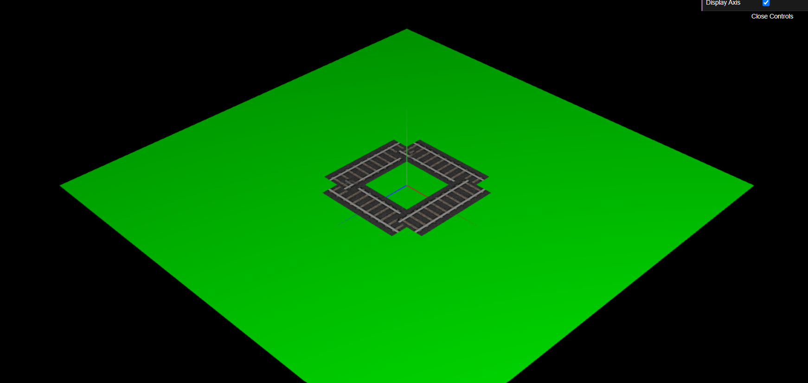

-We created the circle and the possibility to adjust the complexity in order to aproximate the circunference better. The cylinder was also created and its complexity can also be modified. Finally the sphere was created and the world texture was succesfully aplied.

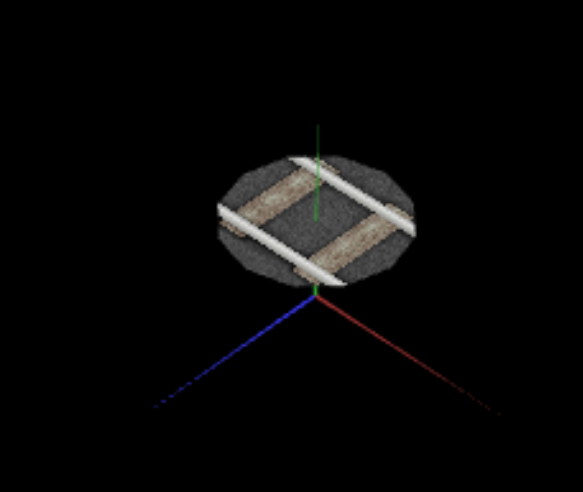

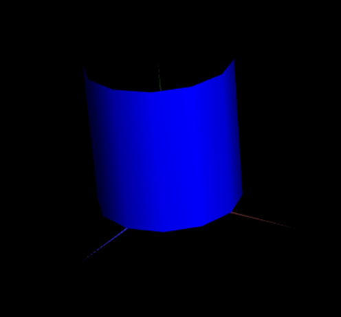

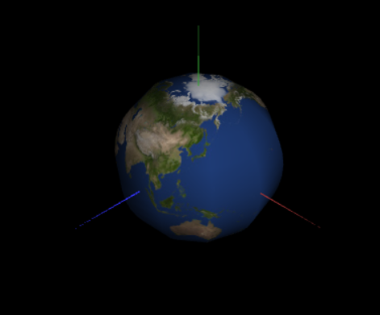

-The locomotive was succesfully constructed using the primitives previously created.

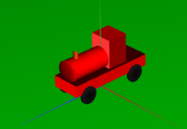

-The scenery was efectively modeled using the Unit Cube and texturing its side. The applied texture can be selected and changed in runtime.

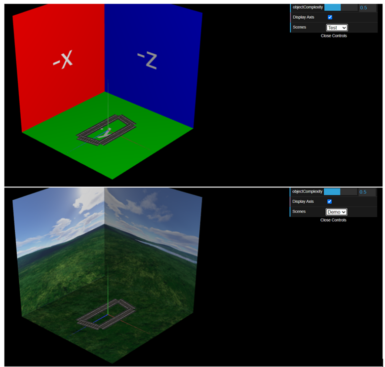

-The crane was succesfully implemented and including the mechanic of picking up the wood and storing it in the trains compartment.

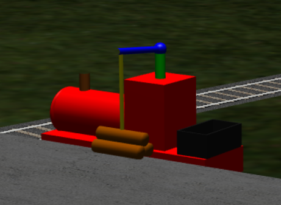

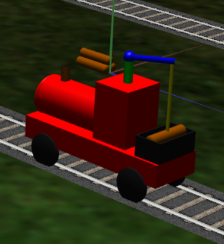

-The station was modeled using geometry and applying textures to its different parts.

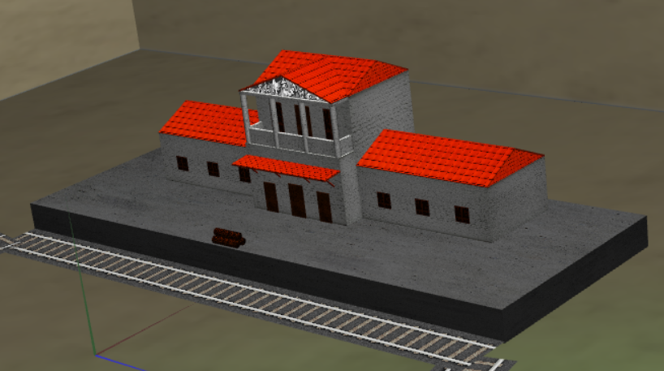 

-Full view of the scenery with textures and lighting.

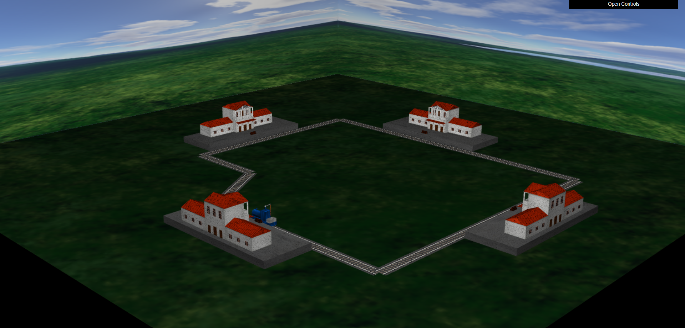

-Smoke implemented.

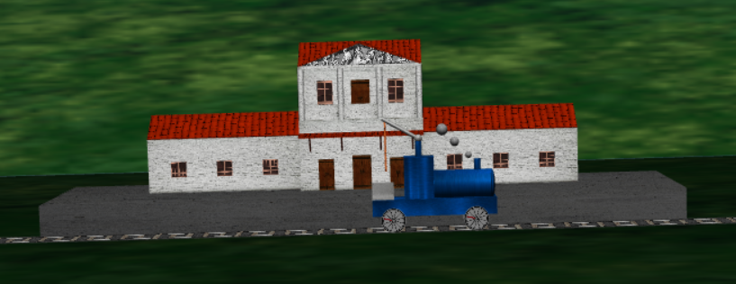

-Rotations of the wheels was implemented. We can see in the first picture the positions of the wheels when the trains is stopped. Then at the second picture we can see that as the trtain is moving the wheels rotate.

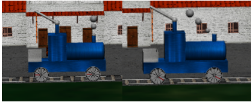

-Smoothing the locomotive animation. The train now turnd gradually, it starts to turn a littile bit before the transition point is reached, and ends a little later.

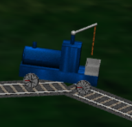

