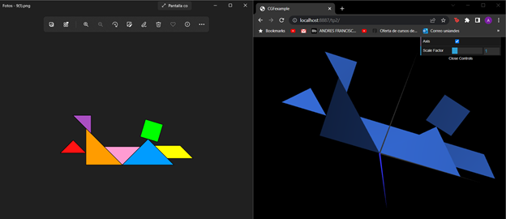
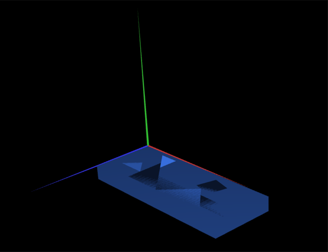
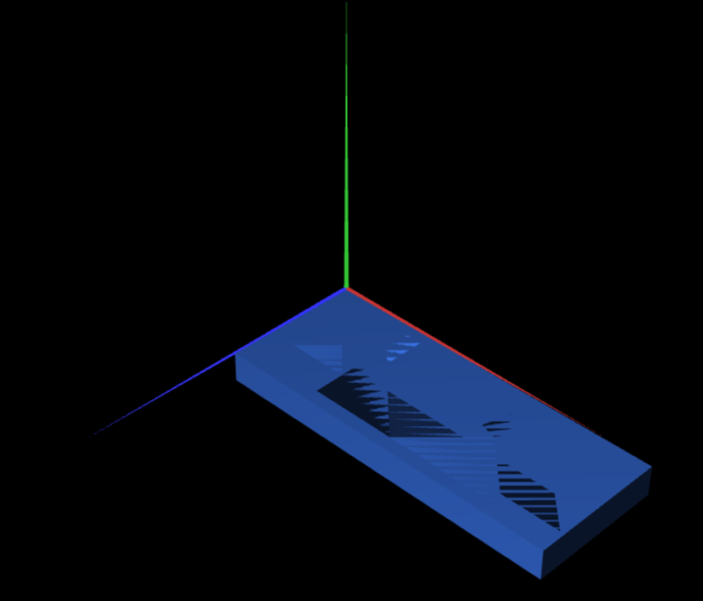

# CGRA 2021/2022

## Group T7xG9y 1

## TP 2 Notes

-We were able to complete the tangram succesfully.

-We were able to put the base in the correct place.

-As it can be seen in the picture replacing the original cube with the new one on the same transformations leads to the same result.

