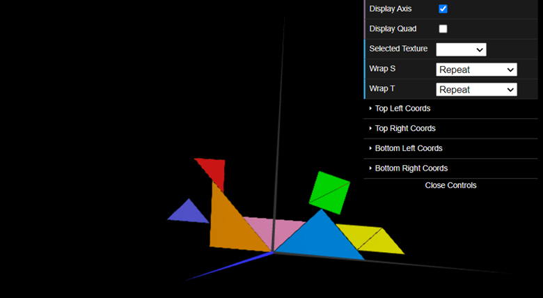
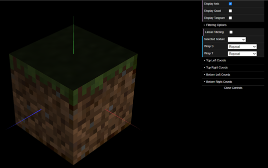

# CGRA 2021/2022

## Group T7xG9y 1

## TP 4 Notes

-We colored each of the tangram pieces with their respective textures.

-The option to choose between linear and nearest filtering was added. In the picture the cube with nearest filtering can be seen resulting in a much clearier image.

